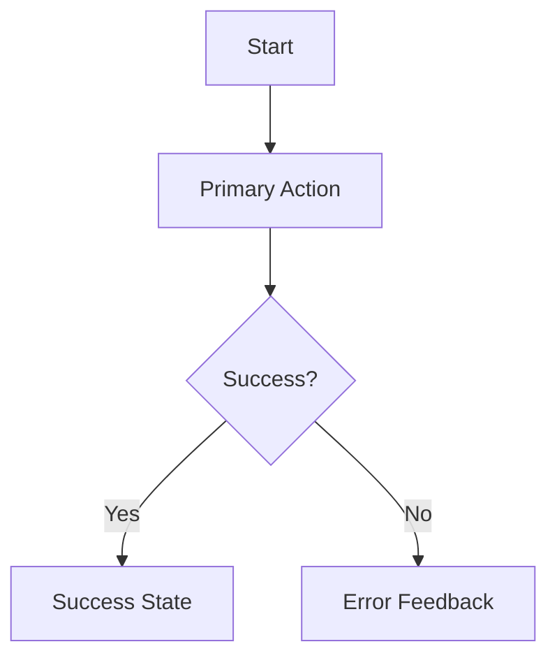

# UI/UX to Frontend Handoff Template

This document is the "Contract" between the Designer and the Frontend Agent. Every design task must conclude with an output following this structure.

## 1. Executive Experience Summary
- **Persona**: [Who is this for?]
- **Core Mood**: [e.g., Professional, Playful, Brutalist]
- **Value Prop**: [What is the main goal the UI achieves?]

## 2. Information Architecture (Mermaid Flow)


## 3. Visual Manifest (The Tokens)
*Note: The Designer must provide these values clearly.*

```css
:root {
  /* Core Colors (OKLCH preferred) */
  --color-bg: #...;
  --color-surface: #...;
  --color-accent: #...;
  --color-text-primary: #...;
  
  /* Layout */
  --grid-columns: 12;
  --container-max-width: 1280px;
  --base-spacing: 8px;
  
  /* Typography */
  --font-heading: '...';
  --font-body: '...';
  --size-base: 16px;
}
```

## 4. Component Specs
*Break down the screen into reusable parts.*

### Component: [Name]
- **Structure**: [Description of HTML semantics]
- **States**:
  - **Hover**: [Visual change]
  - **Active/Pressed**: [Visual change]
  - **Loading**: [Skeleton or progress pattern]
- **A11y**: [Required ARIA labels, focus order]

## 5. Visual References
- **Mockup Description**: [Detailed text description for the LLM to visualize]
- **Image Artifacts**: [Paths to any generated images via generate_image tool]

## 6. Interaction & Motion
- **Entry Animation**: [e.g., Slide up + Fade in]
- **Transition Easing**: [e.g., cubic-bezier(0.4, 0, 0.2, 1)]
- **Feedback**: [Haptic or visual cue on trigger]
